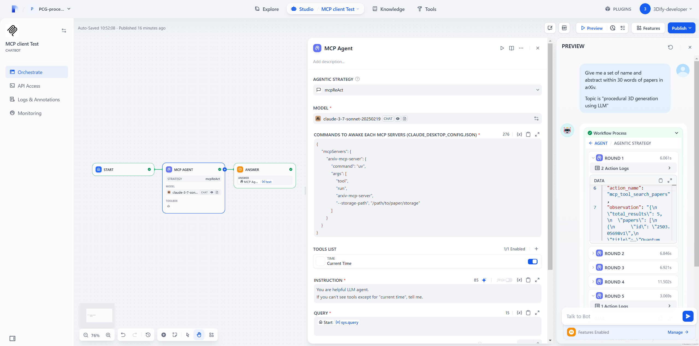
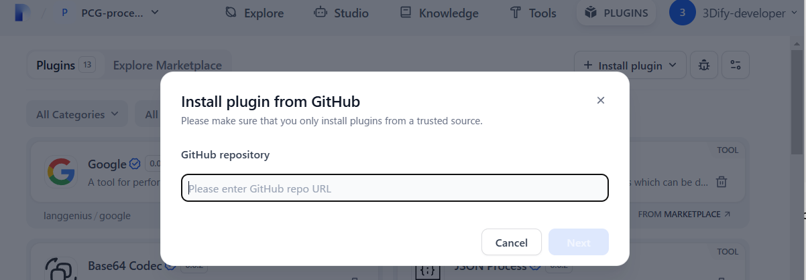

# dify-mcp-client
`MCP Client` as Agent Strategy Plugin.
> [!IMPORTANT]
> Dify is not `MCP Server` but `MCP Host`. 



## How it works
Currently, each `MCP client` (ReAct Agent) node can connect a stdio `MCP server`.
1.  `Tool`, `Resource`, `Prompt` lists are converted into Dify Tools.
2.   Your selected LLM can see their `name`, `description`, `argument type`
3.   The LLM calls Tools based on the ReAct loop (Reason → Act → Observe).

> [!NOTE]
> Most of the code in this repository contains the following files.
> #### Dify Official Plugins / Agent Strategies
> https://github.com/langgenius/dify-official-plugins/tree/main/agent-strategies/cot_agent

## What I did
- Copied `ReAct.py` and renamed file as `mcpReAct.py`
- Added `config_json` GUI input field by editing `mcpReAct.yaml` and `class mcpReActParams()` 

### in mcpReAct.py, I added
- New 12 functions for MCP 
- `__init__()` for initializing `AsyncExitStack` and `event loop`
- Some codes in `_handle_invoke_action()` for MCP 
- MCP setup and cleanup in `_invoke()`
> [!IMPORTANT]
> ReAct while loop is as they are


## Caution and Limitation
> [!CAUTION]
> This plugin does **not** implement a **human-in-the-loop** mechanism by default, so connect **reliable mcp server only**.<br>
> To avoid it, decrease `max itereations`(default:`3`) to `1`, and use this Agent node repeatedly in Chatflow.<br>
> However, agent memory is reset by the end of Workflow, so use `Conversaton Variable` to save history and pass to QUERY.  
> Don't forget to add a phrase such as
> *"ask for user's permission when calling tools"* in INSTRUCTION.

> [!WARNING]
> - The Tools field should not be left blank. so **select Dify tools** like "current time".
> - The SSE connection is not supported

# How to use plugin

### Install plugin from GitHub (online)
- Enter the following GitHub repository name
```
https://github.com/3dify-project/dify-mcp-client/
```
- Dify > PLUGINS > + Install plugin > INSTALL FROM > GitHub


### Install plugin from .difypkg file (offline)
- Go to Releases https://github.com/3dify-project/dify-mcp-client/releases
- Select suitable version of `.difypkg`
- Dify > PLUGINS > + Install plugin > INSTALL FROM > Local Package File


## Compatible claude_desktop_config.json
MCP Agent Plugin node require config_json like this to command to awake an MCP server
```
{
    "mcpservers":
    {
        "name_of_mcpserver":
        {
            "command": "npx",
            "args": ["arg1", "arg2"]
        },
     }
}
```
> [!WARNING]
> - Currently support one MCP server one Agent plugin node
> - `npx.cmd` instead of `npx` if you use Windows

## Chatflow Example

#### I provide this Dify ChatFlow for testing dify mcp plugin as .yml.
https://github.com/3dify-project/dify-mcp-client/tree/main/test/chatflow
#### After download DSL(yml) file, import it in Dify and you can test MCP using "Everything MCP server"
https://github.com/modelcontextprotocol/servers/tree/main/src/everything


# How to develop or debug plugin

### General plugin dev guide
https://github.com/3dify-project/dify-mcp-client/blob/main/GUIDE.md

### Dify plugin SDK daemon
In my case (Windows 11) ,need to download dify-plugin-windows-amd64.exe (v0.0.3)<br>
Choose your OS-compatible verson at here:<br>
https://github.com/langgenius/dify-plugin-daemon/releases <br>
Rename it as dify.exe

#### Reference  
https://docs.dify.ai/plugins/quick-start/develop-plugins/initialize-development-tools

> [!NOTE]
> You can skip this stage if you pull or download codes of this repo
> ```
> dify plugin init
> ```
> Initial settings are as follow 
> 

### Install python module
Python3.12+ is compatible. Dify plugin official installation guide use pip, but I used uv.
```
uv init --python=python3.12
.venv\Scripts\activate
```
Install python modules for plugin development
```
uv add werkzeug==3.0.3
uv add flask
uv add dify_plugin
```

### Copy and rename env.example to .env
I changed `REMOTE_INSTALL_HOST` from `debug.dify.ai` to `localhost` 
(Docker Compose environment)
click bug icon button to see these information

### Change directory
```
cd mcp_client
```

### Do Once
```
pip install -r requirements.txt
```

### Activate Dify plugin
```
python -m main
```
(ctrl+C to stop)
> [!TIP]
> REMOTE_INSTALL_KEY of .env often changes.
> If you encounter error messages like `handshake failed, invalid key`, renew it.


## Useful GitHub repositories for developers

#### Dify Plugin SDKs
https://github.com/langgenius/dify-plugin-sdks

#### MCP Python SDK
https://github.com/modelcontextprotocol/python-sdk
<br>

> [!TIP]
> Especially useful following MCP client example<br>
> https://github.com/modelcontextprotocol/python-sdk/blob/main/examples/clients/simple-chatbot/mcp_simple_chatbot/main.py<br>

> [!NOTE]
> Dify plugin has `requirements.txt` which automatically installs python modules.<br>
> I include `mcp` in it, so you don't need to download the MCP SDK separately.
