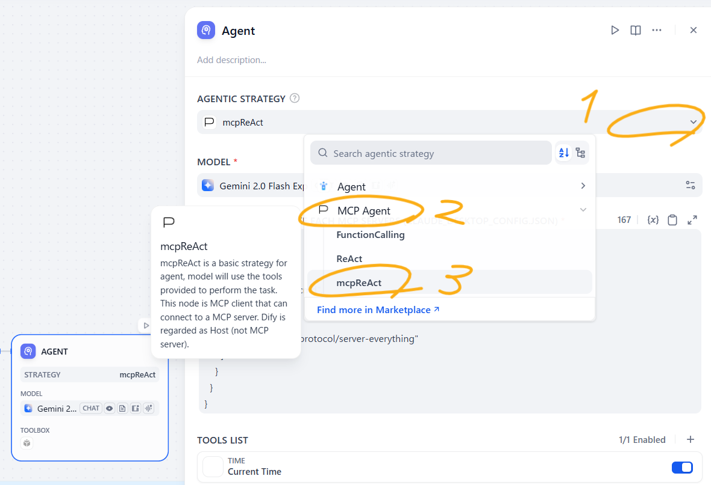
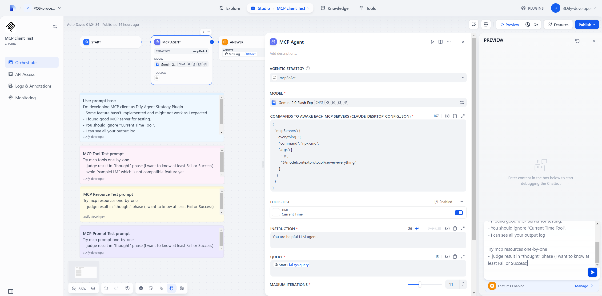

[](https://mseep.ai/app/3dify-project-dify-mcp-client)

# dify-mcp-client
`MCP Client` as Agent Strategy Plugin.
> [!IMPORTANT]
> Dify is not `MCP Server` but `MCP Host`. 


## How it works
Each `MCP client` (ReAct Agent) node can connect `MCP servers`.
1.  `Tool`, `Resource`, `Prompt` lists are converted into Dify Tools.
2.   Your selected LLM can see their `name`, `description`, `argument type`
3.   The LLM calls Tools based on the ReAct loop (Reason → Act → Observe).

> [!NOTE]
> Most of the code in this repository contains the following files.
> #### Dify Official Plugins / Agent Strategies
> https://github.com/langgenius/dify-official-plugins/tree/main/agent-strategies/cot_agent

## ✅ What I did
- Copied `ReAct.py` and renamed file as `mcpReAct.py`
- Added `config_json` GUI input field by editing `mcpReAct.yaml` and `class mcpReActParams()` 

### in mcpReAct.py, I added
- New 12 functions for MCP 
- `__init__()` for initializing `AsyncExitStack` and `event loop`
- Some codes in `_handle_invoke_action()` for MCP 
- MCP setup and cleanup in `_invoke()`

> [!IMPORTANT]
> ReAct while loop is as they are

## 🔄 Update history
- Add SSE MCP client (v0.0.2)
- Support multi SSE servers (v0.0.3)
- Update python module and simplify its dependency (v0.0.4)
  - mcp(v1.1.2→v1.6.0+)
  - dify_plugin(0.0.1b72→v0.1.0)

## ⚠️ Caution and Limitation
> [!CAUTION]
> This plugin does **not** implement a **human-in-the-loop** mechanism by default, so connect **reliable mcp server only**.<br>
> To avoid it, decrease `max itereations`(default:`3`) to `1`, and use this Agent node repeatedly in Chatflow.<br>
> However, agent memory is reset by the end of Workflow.<br>
> Use `Conversaton Variable` to save history and pass it to QUERY.  
> Don't forget to add a phrase such as
> *"ask for user's permission when calling tools"* in INSTRUCTION.

# How to use this plugin 

## 🛜Install the plugin from GitHub
- Enter the following GitHub repository name
```
https://github.com/3dify-project/dify-mcp-client/
```
- Dify > PLUGINS > + Install plugin > INSTALL FROM > GitHub


## ⬇️Install the plugin from .difypkg file
- Go to Releases https://github.com/3dify-project/dify-mcp-client/releases
- Select suitable version of `.difypkg`
- Dify > PLUGINS > + Install plugin > INSTALL FROM > Local Package File


## How to handle errors when installing plugins?

**Issue**: If you encounter the error message: `plugin verification has been enabled, and the plugin you want to install has a bad signature`, how to handle the issue? <br>
**Solution**: Open `/docker/.env` and change from `true` to `false`: 
```
FORCE_VERIFYING_SIGNATURE=false
```
Run the following commands to restart the Dify service:
```bash
cd docker
docker compose down
docker compose up -d
```
Once this field is added, the Dify platform will allow the installation of all plugins that are not listed (and thus not verified) in the Dify Marketplace.
> [!TIP]
> Marketplace need Approval. If stars⭐ reach 100, I'll consider to make PR for them.

## Where does this plugin show up?
- It takes few minutes to install
- Once installed, you can use it any workflows as Agent node
- Select "mcpReAct" strategy (otherwise no MCP)


## Config
MCP Agent Plugin node require config_json like this to command or URL to connect MCP servers
```
{
    "mcpServers":{
        "name_of_server1":{
            "url": "http://host.docker.internal:8080/sse"
        },
        "name_of_server2":{
            "url": "http://host.docker.internal:8008/sse"
        }
    }
}
```
> [!WARNING]
> - Each server's port number should be different, like 8080, 8008, ...
> - If you want to use stdio mcp server, there are 3 ways.
>   1. Convert it to SSE mcp server https://github.com/3dify-project/dify-mcp-client/edit/main/README.md#how-to-convert-stdio-mcp-server-into-sse-mcp-server
>   2. Deploy with source code (**NOT** by .difypkg or GitHub reposity name install) https://github.com/3dify-project/dify-mcp-client/edit/main/README.md#-how-to-develop-and-deploy-plugin
>   3. Pre-install Node.js inside dify-plugin docker (issue:https://github.com/3dify-project/dify-mcp-client/issues/10) guide: https://github.com/tangyoha/tangyoha-bili/tree/master/dify/mcp/map_mcp

## Chatflow Example

> [!WARNING]
> - The Tools field should not be left blank. so **select Dify tools** like "current time".
#### I provide this Dify ChatFlow `.yml` for testing this plugin.
https://github.com/3dify-project/dify-mcp-client/tree/main/test/chatflow
#### After download DSL(yml) file, import it in Dify and you can test MCP using "Everything MCP server"
https://github.com/modelcontextprotocol/servers/tree/main/src/everything

# How to convert `stdio` MCP server into SSE MCP server
## option1️⃣: Edit MCP server's code
If fastMCP server, change like this
```diff
if __name__ == "__main__":
-    mcp.run(transport="stdio")
+    mcp.run(transport="sse")
```

## option2️⃣: via mcp-proxy
```
\mcp-proxy>uv venv -p 3.12
.venv\Scripts\activate
uv tool install mcp-proxy
```
### Check Node.js has installed and npx(.cmd) Path 
(Mac/Linux)
```
which npx
```
(Windows)
```
where npx
```
result
```
C:\Program Files\nodejs\npx
C:\Program Files\nodejs\npx.cmd
C:\Users\USER_NAME\AppData\Roaming\npm\npx
C:\Users\USER_NAME\AppData\Roaming\npm\npx.cmd
```

If claude_desktop_config.json is following schema,
```
{
  "mcpServers": {
    "SERVER_NAME": {
       "command": CMD_NAME_OR_PATH 
       "args": {VALUE1, VALUE2}
    }
  }
}
```
### Wake up stdio MCP server by this command
```
mcp-proxy --sse-port=8080 --pass-environment -- CMD_NAME_OR_PATH --arg1 VALUE1 --arg2 VALUE2 ...
```
If your OS is Windows, use npx.cmd instead of npx. Following is example command to convert stdio "everything MCP server" to SSE via mcp-proxy.
```
mcp-proxy --sse-port=8080 --pass-environment -- C:\Program Files\nodejs\npx.cmd --arg1 -y --arg2 @modelcontextprotocol/server-everything
```

Similarly, on another command line (If you use sample Chatflow for v0.0.3)
```
pip install mcp-simple-arxiv
mcp-proxy --sse-port=8008 --pass-environment -- C:\Users\USER_NAME\AppData\Local\Programs\Python\Python310\python.exe -m -mcp_simple_arxiv
```

Following is a mcp-proxy setup log.
```
(mcp_proxy) C:\User\USER_NAME\mcp-proxy>mcp-proxy --sse-port=8080 --pass-environment -- C:\Program Files\nodejs\npx.cmd --arg1 -y --arg2 @modelcontextprotocol/server-everything
DEBUG:root:Starting stdio client and SSE server
DEBUG:asyncio:Using proactor: IocpProactor
DEBUG:mcp.server.lowlevel.server:Initializing server 'example-servers/everything'
DEBUG:mcp.server.sse:SseServerTransport initialized with endpoint: /messages/
INFO:     Started server process [53104]
INFO:     Waiting for application startup.
INFO:     Application startup complete.
INFO:     Uvicorn running on http://127.0.0.1:8080 (Press CTRL+C to quit)
```

# 🔨 How to develop and deploy plugin

### Official plugin dev guide
https://github.com/3dify-project/dify-mcp-client/blob/main/GUIDE.md

### Dify plugin SDK daemon
If your OS is Windows and CPU is Intel or AMD, you need to download `dify-plugin-windows-amd64.exe` (v0.0.7)<br>
Choose your OS-compatible verson here:<br>
https://github.com/langgenius/dify-plugin-daemon/releases <br>
1. Rename it as dify.exe for convinence
2. mkdir "C\User\user\\.local\bin" (Windows) and register it as system path.
3. Copy `dify.exe` to under dify-mcp-client/ 
> [!TIP]
> Following guide is helpful.
> https://docs.dify.ai/plugins/quick-start/develop-plugins/initialize-development-tools

### Reference  
https://docs.dify.ai/plugins/quick-start/develop-plugins/initialize-development-tools

> [!NOTE]
> You can skip this stage if you pull or download codes of this repo
> ```
> dify plugin init
> ```
> Initial settings are as follow 
> 

### Change directory
```
cd dify-mcp-client
```

### Install python module
Python3.12+ is compatible. The `venv` and `uv` are not necessary, but recommended.
```
uv venv -p 3.12
.venv\Scripts\activate
```
Install python modules for plugin development
```
uv pip install -r requirements.txt
```

### Duplicate `env.example` and rename one to `.env`
I changed `REMOTE_INSTALL_HOST` from `debug.dify.ai` to `localhost` 
(Docker Compose environment)
click 🪲bug icon button to see these information

### Activate Dify plugin
```
python -m main
```
(ctrl+C to stop)
> [!TIP]
> REMOTE_INSTALL_KEY of .env often changes.
> If you encounter error messages like `handshake failed, invalid key`, renew it.

### Package into .difypkg
`./dify-mcp-client` is my default root name
```
dify plugin package ./ROOT_OF_YOUR_PROJECT
```

## Useful GitHub repositories for developers

#### Dify Plugin SDKs
https://github.com/langgenius/dify-plugin-sdks

#### MCP Python SDK
https://github.com/modelcontextprotocol/python-sdk
<br>

> [!TIP]
> MCP client example<br>
> https://github.com/modelcontextprotocol/python-sdk/blob/main/examples/clients/simple-chatbot/mcp_simple_chatbot/main.py<br>

> [!NOTE]
> Dify plugin has `requirements.txt` which automatically installs python modules.<br>
> I include latest `mcp` in it, so you don't need to download the MCP SDK separately.
